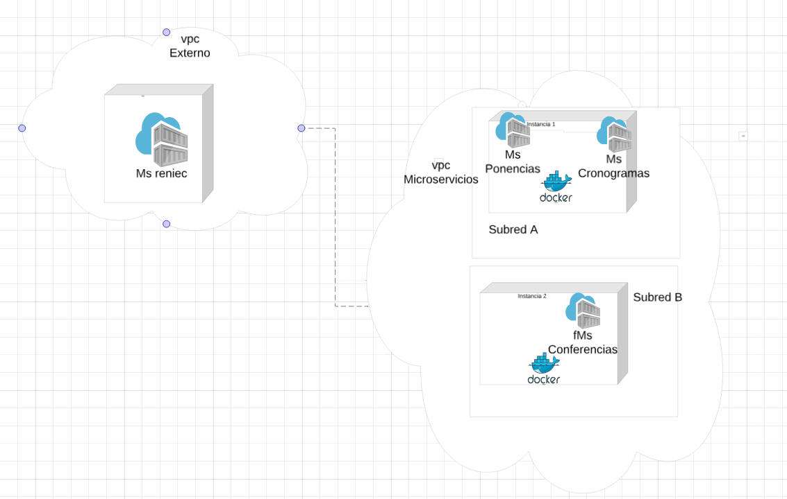

# Proyecto de Arquitectura de Microservicios con Microfrontends

Este proyecto implementa una arquitectura de microservicios con microfrontends, comunicándose mediante un **API Gateway** y un **Event Bus** para manejar eventos asíncronos. Los microservicios están desacoplados, cada uno tiene su propia base de datos y son escalables de forma independiente.

## Requisitos del Sistema (Alto Nivel)

### Descripción General

- **Objetivo**: Crear un sistema modular y escalable que administre eventos como conferencias, talleres, pagos, inscripciones y gestión de perfiles de usuarios.
- **Arquitectura**: Arquitectura basada en microservicios con microfrontends, soportada por un **API Gateway** para manejo de solicitudes síncronas y un **Event Bus** para comunicación asíncrona entre microservicios.
- **Frontend**: Se utiliza un enfoque de microfrontends para permitir el uso de múltiples frameworks de frontend y facilitar la modularidad de la aplicación.
- **Backend**: Cada microservicio se encarga de un dominio específico, tiene su propia base de datos y se comunica de manera independiente con otros servicios a través del Event Bus o el API Gateway.

---

## Requisitos Funcionales

### 1. Gestión de Conferencias
- **Funcionalidad**: Los administradores pueden crear, editar, activar/desactivar y listar conferencias.
- **Microfrontend**: Angular
- **Microservicio**: `Conferencias`
- **Base de datos**: Almacena detalles de las conferencias.
- **Endpoints**:
  - Crear, listar, editar y desactivar conferencias.

### 2. Gestión de Inscripciones
- **Funcionalidad**: Permitir a los usuarios registrarse y anular inscripciones en conferencias.
- **Microfrontend**: React
- **Microservicio**: `Inscripciones`
- **Base de datos**: Almacena detalles de las inscripciones.
- **Endpoints**:
  - Registrar, anular y listar inscripciones.

### 3. Gestión de Ponencias
- **Funcionalidad**: Administración de ponencias relacionadas con cada conferencia.
- **Microfrontend**: Angular
- **Microservicio**: `Ponencias`
- **Base de datos**: Almacena detalles de cada ponencia.
- **Endpoints**:
  - Crear, listar y editar ponencias.

### 4. Gestión del Cronograma
- **Funcionalidad**: Crear y editar cronogramas de conferencias.
- **Microfrontend**: Svelte
- **Microservicio**: `Cronograma`
- **Base de datos**: Almacena datos de cronogramas.
- **Endpoints**:
  - Crear, listar y editar cronogramas.

### 5. Gestión de Talleres
- **Funcionalidad**: Administración de talleres dentro de cada conferencia.
- **Microfrontend**: Vue
- **Microservicio**: `Talleres`
- **Base de datos**: Almacena detalles de los talleres.
- **Endpoints**:
  - Crear, listar y editar talleres.

### 6. Gestión de Pagos
- **Funcionalidad**: Procesar pagos de inscripciones a conferencias.
- **Microfrontend**: React
- **Microservicio**: `Pagos`
- **Base de datos**: Almacena detalles de los pagos.
- **Endpoints**:
  - Registrar pago, cancelar pago, verificar estado de pago.

### 7. Gestión de Perfiles de Usuarios
- **Funcionalidad**: Permitir a los usuarios gestionar sus datos personales.
- **Microfrontend**: Vue
- **Microservicio**: `Personas`
- **Base de datos**: Almacena datos de usuarios.
- **Endpoints**:
  - Crear, actualizar y listar datos personales.

---

